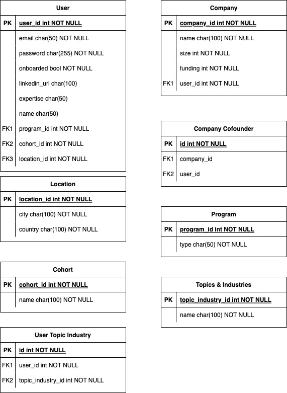

# Antler Tech Challenge

## Diagram

## Summary

Antler run cohorts around the world that accept ambitious founders looking to build a startup or propel their existing startup to further success. We want to make sure that the onboarding process for founders into our system is seamless and captures the data we need to enable a successful journey at Antler.

Your task is to create an onboarding flow for founders and startups accepted into the Antler Program.

## Requirements

A user can either be a solo founder looking to build a company or a founder of an existing, funded startup. Once they are accepted into the program, they get invited to complete an onboarding flow. Both user journeys will be different, as we want to capture more relevant, custom data for each user path.

1. Currently, we have accepted these founders into Antler. Only these users will be able to continue to the onboarding flow.

   | Name          | Email                   | Program Location  | Cohort   | Program Type |
   | ------------- | ----------------------- | ----------------- | -------- | ------------ |
   | Liam Swift    | liam.swift@antler.co    | Sydney, Australia | SYD_1013 | Founder      |
   | Scott Waddle  | scott.waddle@antler.co  | Sydney, Australia | SYD_1013 | Founder      |
   | Jack McDonald | jack.mcdonald@antler.co | Berlin, Germany   | BER_0126 | Startup      |
   | Nic Touron    | nic@antler.co           | Berlin, Germany   | BER_0126 | Startup      |
   | Oly Lotfi     | oly.lotfi@antler.co     | Berlin, Germany   | BER_0126 | Startup      |
   | Daniel Henry  | daniel.henry@antler.co  | Berlin, Germany   | BER_0126 | Startup      |

   Users will have the option to sign up via email and password.

2. We will need to capture profile data for all founders, regardless of their program type:

   - Linkedin url (optional)
   - Expertise (e.g. technical, design, product) as a text field
   - Topics and industries of interest as a list of the following options [here](#1-list-of-topics-and-industries-of-interest)

### If the user is the founder of an existing startup, we need to capture information about their startup

3. The user can select co-founders for their startup:

   - The user can select co-founders (if they have any) of a startup program from the same cohort that do not yet have a startup company assigned.
   - If another user has assigned them as a co-founder already, the user is shown the all data regarding the startup (name, size, funding, co-founders). The user can then progress past step 4. straight to the app dashboard.

4. We will need to get more information about the startup: (Skip if user has has been assigned a startup already)

   - Company name
   - Company size
   - Funding raised

5. The user is onboarded and is taken to the app dashboard (placeholder page that only onboarded users can access)

## Technology Stack

Your solutions should contain the following technologies:

- Frontend Framework (e.g. React, Angular, Vue)
- Typescript
- Apollo Client
- React UI Component Library (e.g. Chakra UI, Mantine, Material UI)
- Hasura GraphQL Engine
- Any additional packages/libraries that you see fit

### Hasura Considerations

Given this task doesn't require an auth provider, you'll need to setup tables in Hasura with permissions for an 'unauth' role. More info can be found [here](https://hasura.io/docs/latest/graphql/core/auth/authentication/unauthenticated-access/)

## Setup

To begin, fork this repo and begin working in a new repository.

1. The configuration for Hasura has already been setup, you will just need to follow the steps found [here](./hasura/README.md)
2. Although you can choose to use any frontend framework, a Next.js project antler-onboarding has been setup with Apollo client, using the endpoint from the local Hasura instance. Just install the packages and you are good to start!

## What we are looking for

- Strong Typescript/JS fundamentals
- Clean and performant code
- Regular commits with concise, clear messages
- Good product design and consistent UI
- Appropriate error handling
- Database structure that maps to business requirements

## Submission

Send a link to your repository back to us when you are finished!

## Questions

If you are having any trouble with the setup or are unsure of requirements, feel free to reach out with some questions - we'll be happy to clarify them for you.

## Appendix

### 1. List of Topics and Industries of Interest

- Adtech
- Aerospace
- Agriculture
- Analytics
- ArtTech
- B2B SaaS
- Biotech/Longevity
- ClimateTech
- Community
- Construction
- Consumer Tech
- Creator Economy
- Crypto, DeFi & Blockchain
- Data/Infrastructure
- Developer Tools
- Drug Discovery
- Education
- Energy/CleanTech
- Entertainment
- Financial Services/FinTech
